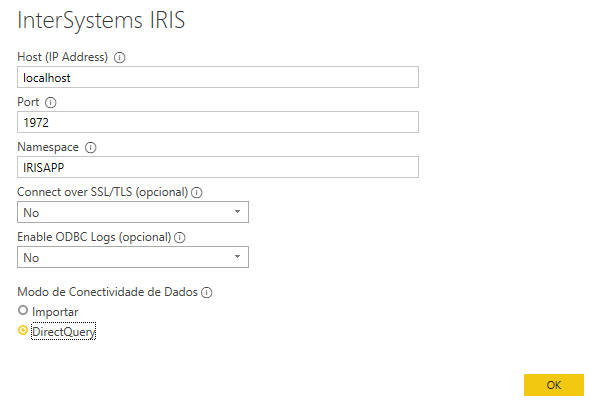

Inspired on a Netflix documentary called [this is pop](https://www.netflix.com/br/title/81050786), it is an exercise to analyse the songs that was on billboard top 100 songs in the last years.
For this project was used a csv file with all Billboard Hot 100 from 2000 to 2018, created by "Michael Tauberg" [@typhon](https://data.world/typhon) available on [Data World project](https://data.world/typhon/billboard-hot-100-songs-2000-2018-w-spotify-data-lyrics)

# Report


## Installation

### Docker
The repo is dockerised so you can  clone/git pull the repo into any local directory

```
$ git clone https://github.com/henryhamon/pop-song-analytics.git
```

Open the terminal in this directory and run:

```
$ docker-compose up -d
```
The script in Installer.cls will import everything you place under /src into IRIS.

### MS Power BI
Open the power bi file locate on __./dsw/pop_songs_analytics_powerbi.pbix__
You could configure the data source, go to "Get Data" and select InterSystems IRIS.

Follow the setup below:




## What's inside the repository

### Dockerfile

The simplest dockerfile which starts IRIS and imports Installer.cls and then runs the Installer.setup method, which creates IRISAPP Namespace and imports ObjectScript code from /src folder into it.
Use the related docker-compose.yml to easily setup additional parametes like port number and where you map keys and host folders.
Use .env/ file to adjust the dockerfile being used in docker-compose.

### PowerBI file
The MS Power BI file locate on __./dsw/pop_songs_analytics_powerbi.pbix__


### .vscode/settings.json

Settings file to let you immedietly code in VSCode with [VSCode ObjectScript plugin](https://marketplace.visualstudio.com/items?itemName=daimor.vscode-objectscript))

### .vscode/launch.json
Config file if you want to debug with VSCode ObjectScript
